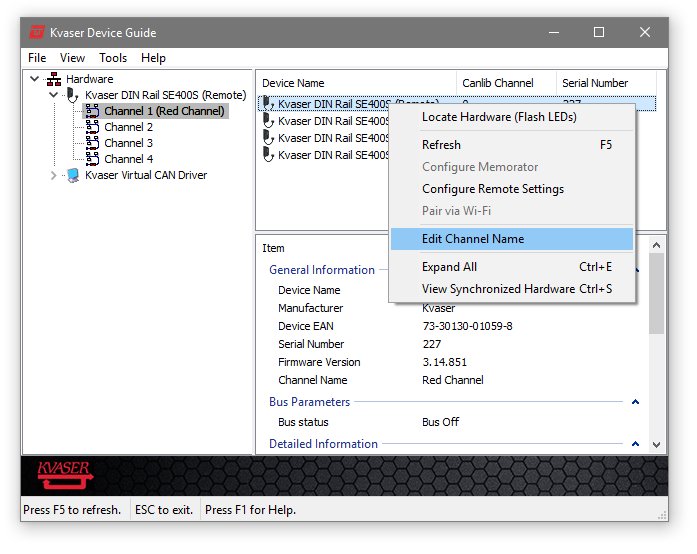

Devices and Channels
====================

Identifying Devices and Channels
--------------------------------

Once we have imported `canlib.canlib`, which enumerates the connected Kvaser CAN
devices, we can call `~canlib.canlib.getNumberOfChannels` to get the number of
enumerated channels in our system.

This code snippet reads the number of enumerated channels found in the PC:

>>> from canlib import canlib
>>> canlib.getNumberOfChannels()
8

Channel Information
-------------------

Use `~canlib.canlib.ChannelData` to obtain data for a specific channel, for
example, the hardware type of the CAN interface.

We can use `~canlib.canlib.ChannelData` for the CANlib channel numbers 0, 1,
2,..., n-1 (where n is the number returned by
`~canlib.canlib.getNumberOfChannels`) to get information about that specific
channel.

To uniquely identify a device, we need to look at both the
`ChannelData.card_upc_no` and `ChannelData.card_serial_no`.

The following code snippet loops through all known channels and prints the type
of the CAN card they're on.

    >>> from canlib import canlib
    ...
    ... num_channels = canlib.getNumberOfChannels()
    ... print("Found %d channels" % num_channels)
    ... for channel in range(0, num_channels):
    ...     chdata = canlib.ChannelData(channel)
    ...     print("%d. %s (%s / %s)" % (
    ...         channel,
    ...         chdata.channel_name,
    ...         chdata.card_upc_no,
    ...         chdata.card_serial_no)
    ...     )
    Found 8 channels
    0. Kvaser Leaf Light HS (channel 0) (73-30130-00241-8 / 1346)
    1. Kvaser Memorator Pro 2xHS v2 (channel 0) (73-30130-00819-9 / 11573)
    2. Kvaser Memorator Pro 2xHS v2 (channel 1) (73-30130-00819-9 / 11573)
    3. Kvaser Leaf Pro HS v2 (channel 0) (73-30130-00843-4 / 10012)
    4. Kvaser Hybrid 2xCAN/LIN (channel 0) (73-30130-00965-3 / 1100)
    5. Kvaser Hybrid 2xCAN/LIN (channel 1) (73-30130-00965-3 / 1100)
    6. Kvaser Virtual CAN Driver (channel 0) (00-00000-00000-0 / 0)
    7. Kvaser Virtual CAN Driver (channel 1) (00-00000-00000-0 / 0)

Customized Channel Name
-----------------------
It is possible to set the customized name returned by `ChannelData.card_serial_no` on the device using Kvaser Device Guide by right clicking on the device channel and selecting "Edit Channel Name"

   Setting the device's Channel Name from inside Kvaser Device Guide

Now we can read the customized name:

    >>> from canlib import canlib
    >>> chdata = canlib.ChannelData(channel_number=0)
    >>> chdata.custom_name
    'Red Channel'

Virtual Channels
----------------

CANlib supports virtual channels that you can use for development, test or
demonstration purposes when you don't have any hardware installed.

To open a virtual channel, call `~canlib.canlib.openChannel` with the
appropriate channel number, and specify `~canlib.canlib.Open.ACCEPT_VIRTUAL` in the
flags argument to canOpenChannel().
